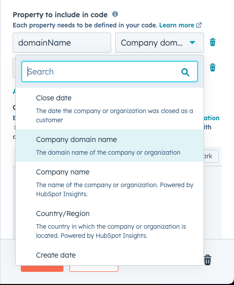

# What does it do ? 

The idea of this Custom Coded Action is to identify the text language based on a sample 

# Setup 

Copy the content of the /dist folder in a custom coded action block. 

Set and propoerties to include in code and the right output

## If the Custom Coded Action requires to include properties in the code


It means you have to select in the dropdown the text to analyze name and put as a variable name ```textToAnalyze``` like so ( instead of domainName choose the text you want to analyze)




## Output 


If the entry is 

```
 textToAnalyze: "Bonjour je suis Antoine et je travail chez HubSpot, j'ai une question pour vous"
```


If you do not understand  how to put the output read / watch the ( Return data to the worflow) in that article : https://www.antoinebrossault.com/write-you-first-hubspot-operation-hub-custom-code/#:~:text=Return%20data%20to%20the%20workflow

The custom code returns : 
```
 The output of the Custom Coded Action is : 
┌────────────┬─────────────────────┐
│  (index)   │       Values        │
├────────────┼─────────────────────┤
│  language  │      'french'       │
│ confidance │ 0.35523148148148154 │
└────────────┴─────────────────────┘
```

```
 The types are : 
┌────────────┬──────────┐
│  (index)   │  Values  │
├────────────┼──────────┤
│  language  │ 'string' │
│ confidance │ 'number' │
└────────────┴──────────┘
```