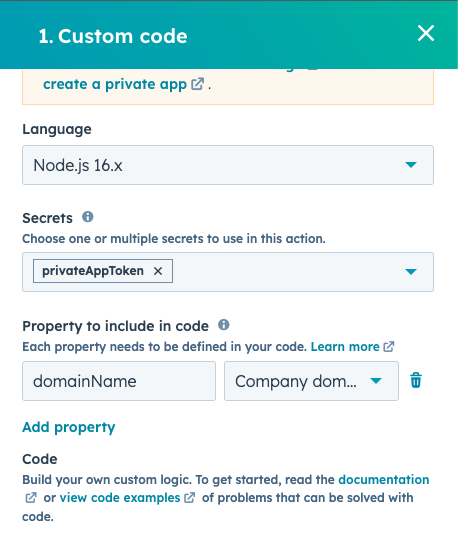
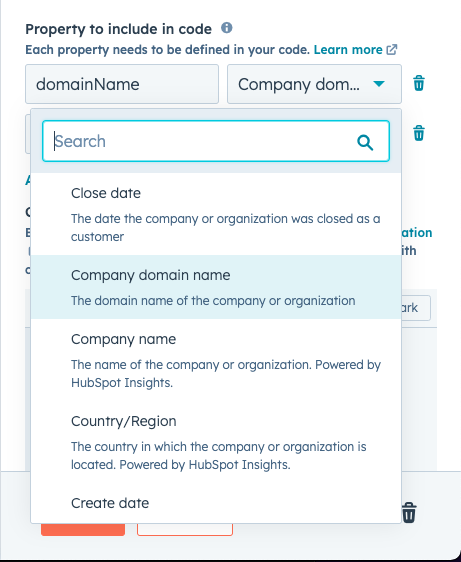

# What does it do ? 

The idea of this Custom Coded Action is to detect first

# Setup 

## If the Custom Coded Action calls the API 

You need to have a Private App token named ```privateAppToken``` in the Secrets section like so :



[How to create a token](https://developers.hubspot.com/docs/api/private-apps)


## If the Custom Coded Action requires to include properties in the code

Check if the ```event.js``` has data set, if the event.js file contains something like : 

```JavaScript
    inputFields: {
        domainName : "google.com"
    }
```

It means you have to select in the dropdown the company domain name and put as a variable name ```domainName``` like so 


